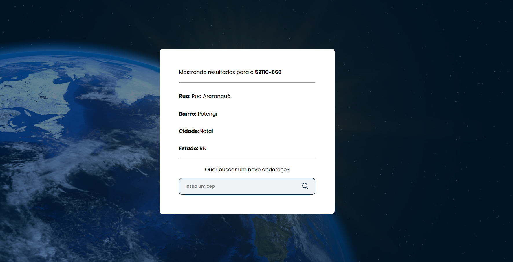

<br />
<p align="center">
  <h3 align="center">Procurar um endereço</h3>

  <p align="center">
    Sistema para encontrar dados de um determinado CEP
    <br />
    <a href="https://buscar-endereco.netlify.app/" target="_blank"><strong>Veja o site online »</strong></a>
    <br />
    <br />
  </p>


</p>

# 📌 Índice

- [Sobre o projeto](#sobre)
  - [Feito com](#feito)
- [Features](#features)
- [Iniciando o projeto](#iniciando)
  - [Pré-requisitos](#requisitos-minimos)
  - [Instalação](#instalacao)

## 💻 Sobre o projeto <a name="sobre"></a>

<p align="center">
  
</p>

O projeto **Procurar um endereço** é um sistema que mostrar os dados atribuidos a um CEP.

## 📝 Feito com <a name="feito"></a>

- TypeScript
- React

## 🖥 Features <a name="features"></a>

- Tela de listagem dos dados referentes ao CEP informado
- Tela de erro caso o CEP informado não exista

## 🔴 Iniciando o projeto <a name="iniciando"></a>

### ❗ Pré-requisitos <a name="requisitos-minimos"></a>

Para rodar o projeto é necessário ter os seguintes itens instalados na sua máquina.

- Node
- TypeScript

### 📥 Instalação <a name="instalacao"></a>

Clone o repositório

```sh
git clone https://github.com/SwannyAlves/procurar-endereco
```

Instale as dependências rodando o comando

```sh
yarn install
```

Digite o comando para ligar o servidor

```JS
yarn start
```
